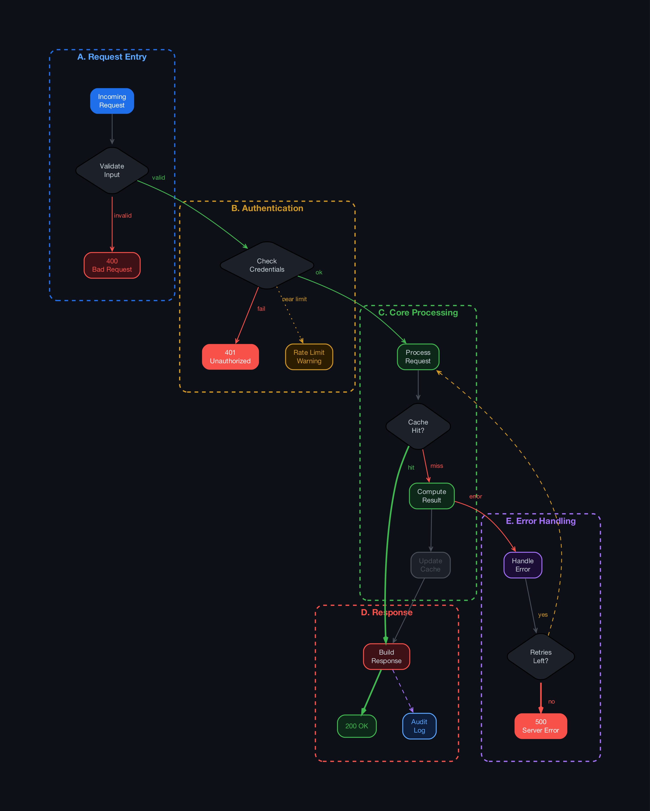
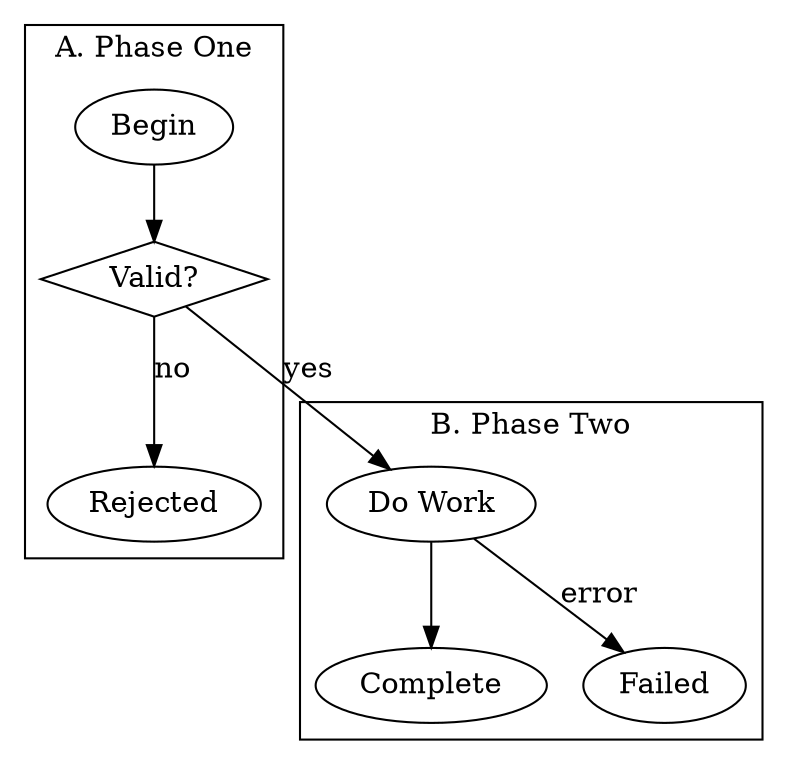

# flow-basics

Dark-themed Graphviz flow diagrams with semantic classes. Write clean `.dot` files, get pretty SVG + PNG.



## Quick start

```bash
./gen.sh                    # renders example.dot -> example.svg + example.png
./gen.sh myflow.dot         # renders myflow.dot  -> myflow.svg  + myflow.png
./gen.sh a.dot output       # renders a.dot       -> output.svg  + output.png
```

Requires `graphviz` and `python3`:
```bash
brew install graphviz       # macOS
apt install graphviz        # Linux
```

## Instructions for AI agents

When asked to generate a flow diagram, create a `.dot` file following these rules exactly.

### Structure



### Rules

1. Use `digraph Name { }` — the name can be anything
2. Group related nodes in `subgraph cluster_* { }` blocks with a `label="..."`
3. Cluster colors are auto-assigned — do NOT add any color/style attributes
4. Apply `class=` on nodes and edges for semantic styling (see tables below)
5. Use `shape=diamond` on decision/question nodes alongside `class=decision`
6. Keep node labels short (1-3 words), use `\n` for line breaks
7. Do NOT add any `color`, `fillcolor`, `fontcolor`, `style`, `bgcolor`, `penwidth`, or `fontname` attributes — `render.py` handles all styling
8. Do NOT add `rankdir` or `compound` — these are set automatically

### Node classes

| Class | When to use |
|-------|-------------|
| `start` | Entry point / trigger |
| `decision` | Yes/no question (always pair with `shape=diamond`) |
| `success` | Happy end state |
| `fail` | Hard failure end state |
| `drop` | Rejected / discarded |
| `warn` | Warning / caution state |
| `info` | Informational / metadata |
| `muted` | Background / low-priority step |
| _(none)_ | Normal processing step — inherits cluster color |

### Edge classes

| Class | Style | When to use |
|-------|-------|-------------|
| `yes` | green solid | Positive branch from a decision |
| `no` | red solid | Negative branch from a decision |
| `major` | thick green | Critical happy path (no label) |
| `major_yes` | thick green | Critical path with label |
| `major_no` | thick red | Critical failure path with label |
| `timeout` | thick red | Timeout / deadline exceeded |
| `retry` | dashed yellow | Retry attempt |
| `retry_back` | dashed yellow | Retry going backward to earlier step |
| `loop` | dashed grey | Generic loop back |
| `yes_loop` | dashed green | Positive loop |
| `fail_loop` | dashed red | Failure retry loop |
| `skip` | dotted grey | Skipped / bypassed |
| `async` | dashed purple | Async / fire-and-forget |
| `optional` | dotted yellow | Optional / conditional path |
| _(none)_ | grey solid | Normal flow between steps |

### Rendering

After creating the `.dot` file, run:

```bash
./gen.sh myfile.dot
```

This produces `myfile.svg` and `myfile.png` with the dark theme applied.
